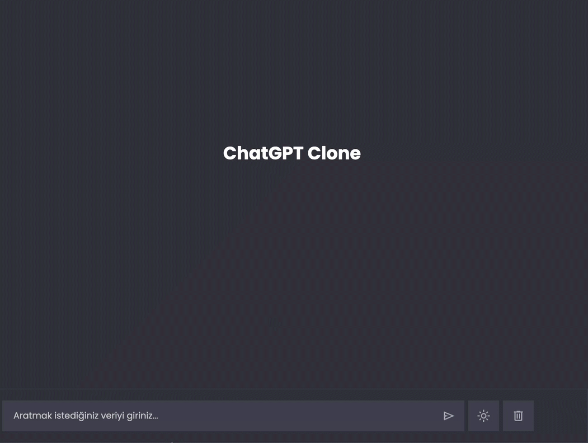

# ChatGPT Clone

This project is a simple ChatGPT clone application that allows users to type queries in a search bar and receive responses via API requests. The application features a chatbot interface with dark/light mode support and uses `LocalStorage` to remember user preferences.

## Features

- **User Input**: Users can type queries or prompts in the search bar.
- **API Integration**: Sends user input as API requests and retrieves responses from an external API.
- **Dark/Light Mode**: Users can toggle between dark and light themes. The selected mode is saved using `LocalStorage`.
- **LocalStorage**: Stores user preferences such as theme selection and retains data across sessions.
- **Real-time Interaction**: Displays responses from the API immediately after receiving them.
- **Clean Interface**: A simple and user-friendly interface for a seamless chatting experience.

## Technologies Used

- **HTML** - For the structure of the application.
- **CSS** - For styling, responsive design, and dark/light mode.
- **JavaScript** - For handling API requests, user input, dark/light mode toggle, and `LocalStorage` management.

# chatGPT-Clone
